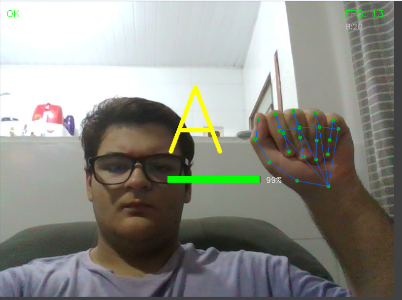
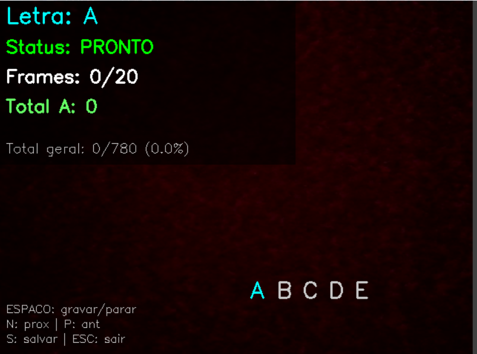
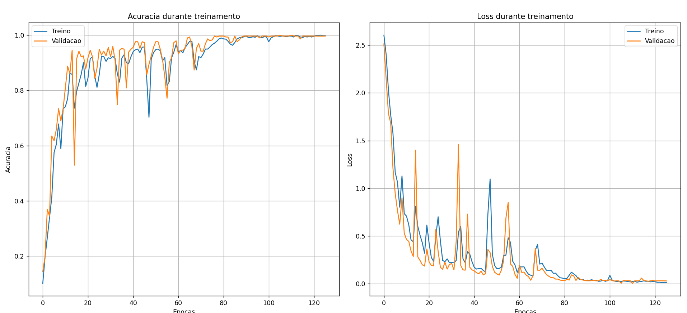
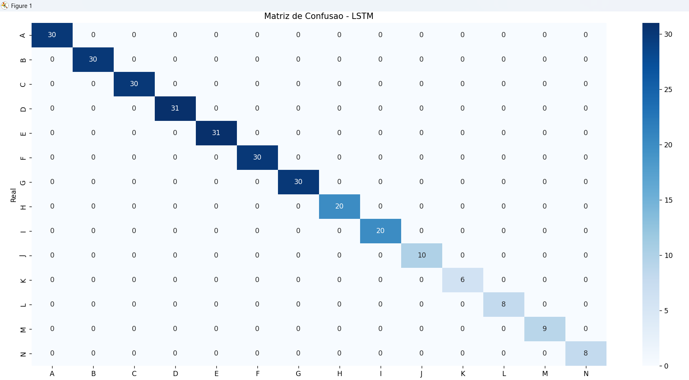

# Libridge
### Sign Language Recognition System with Artificial Intelligence


**Libridge** is a **Sign Language (LIBRAS) recognition system** using **Computer Vision and Deep Learning**.

The project uses:

- **MediaPipe Hand Tracking** for hand detection
- **TensorFlow / Keras (LSTM)** for sequence recognition
- **OpenCV** for video capture
- **Sequential Machine Learning** to identify movements and signs

The goal is to create a **bridge between Sign Language communication and computer systems**.

---

# Requirements

To run the project correctly, it is recommended to have:

- **Python 3.11**
- Webcam
- Operating System: **Windows, Linux, or Mac**

Some libraries like **TensorFlow** and **MediaPipe** may have compatibility issues with newer Python versions.
Therefore, the project was developed and tested using **Python 3.11**.

To check your Python version:

```bash
python --version
```

---

# Demonstration

## Hand Detection



---

## Data Collector Interface



---

## AI Training



---

## Confusion Matrix



---

# How It Works

Libridge works in **3 main steps**:

### 1. Data Collection

The webcam captures **hand movement sequences**.

Each sequence contains:

20 frames  
21 hand landmarks  
3 coordinates (x,y,z)

Total per frame:

21 × 3 = 63 features

Total per sequence:

20 × 63 = 1260 features

This data is saved in the dataset:

dados/dataset_libras.csv

---

### 2. AI Training

The neural network uses **LSTM (Long Short-Term Memory)** to learn **movements over time**.

Architecture:

LSTM (128)  
Dropout  

LSTM (64)  
Dropout  

LSTM (32)  
Dropout  

Dense (64)  
Dense (32)  

Softmax

Output:

26 classes (A-Z)

---

### 3. Real-Time Detection

The system:

1. Captures webcam frames
2. Detects the hand
3. Extracts landmarks
4. Forms a sequence
5. AI predicts the letter

All in **real-time**.

---

# Project Structure

```
libridge/

├── dados/
│ └── dataset_libras.csv
│
├── modelos/
│ ├── melhor_modelo_libras.keras
│ ├── label_encoder.pkl
│ └── config.pkl
│
├── resultados/
│ ├── historico_treinamento.png
│ └── matriz_confusao.png
│
├── coletor_dados.py
├── treinador.py
├── detector_tempo_real.py
├── main.py
│
└── README.md
```

---

# Installation

## 1. Clone the project

```bash
git clone https://github.com/seu-usuario/libridge.git
cd libridge
```

---

## 2. Create virtual environment (Python 3.11 recommended)

### Linux / Mac

```bash
python3.11 -m venv venv
source venv/bin/activate
```

### Windows

```bash
py -3.11 -m venv venv
venv\Scripts\activate
```

---

## 3. Install dependencies

It is recommended to use the command below to ensure the **correct pip from the virtual environment** is used:

```bash
python -m pip install -r requirements.txt
```

If the **requirements.txt** file does not exist, install manually:

```bash
pip install tensorflow opencv-python mediapipe pandas numpy scikit-learn seaborn matplotlib joblib scipy
```

---

# How to Use

Run the main menu:

```bash
python main.py
```

Menu:

1. Collect data  
2. Train AI  
3. Real-time detection  
4. Statistics  
5. Exit  

---

# 1. Collect Data

Captures movement sequences to train the AI.

```bash
python coletor_dados.py
```

**Important warning**

The repository **already includes a base dataset** in:

```
dados/dataset_libras.csv
```

Therefore, **it is not mandatory to collect data again** to train the model.

You can:

- use the existing dataset
- complement with new data
- or create your own dataset

Controls:

SPACE → start/stop recording  
N → next letter  
P → previous letter  
S → save dataset  
ESC → exit  

Recommended:

30 sequences per letter

Total ideal:

26 letters × 30 = 780 samples

---

# 2. Train Model

Trains the LSTM neural network.

```bash
python treinador.py
```

Outputs:

modelos/melhor_modelo_libras.keras  
modelos/label_encoder.pkl  
modelos/config.pkl  

Generated results:

resultados/historico_treinamento.png  
resultados/matriz_confusao.png  

---

# 3. Real-Time Detection

Runs Sign Language recognition via webcam.

```bash
python detector_tempo_real.py
```

Interface shows:

detected letter  
confidence  
FPS  
hand landmarks  

---

# Dataset Statistics

Shows:

- total samples
- existing letters
- sequences per letter

---

# Dataset Example

```
letra,f0_x0,f0_y0,f0_z0,f0_x1,f0_y1,f0_z1...
A,0.89,0.73,-0.0000009,0.79,0.73,-0.02...
A,0.88,0.72,-0.0000009,0.78,0.73,-0.03...
```

Each row represents a complete movement sequence.

---

# Results

Example obtained in training:

Accuracy: ~99%  
Loss: low  

Almost perfect confusion matrix.

---

# Technologies Used

Python  

TensorFlow / Keras  

OpenCV  

MediaPipe  

NumPy  

Pandas  

Scikit-Learn  

Matplotlib  

Seaborn  

---

# Future Improvements

Word recognition  

Sign Language → Text translation  

Sign Language → Voice translation  

More robust model (Transformer)  

Larger dataset  

Web interface  

---

# Contributing

Pull requests are welcome.

1. Fork the project  

2. Create a branch

```bash
git checkout -b my-feature
```

3. Commit

```bash
git commit -m "New feature"
```

4. Push

```bash
git push origin my-feature
```

5. Open a Pull Request

---

# License

This project is under the MIT license.

---

# Author

Project developed by:

José Aquino Junior

Technology student, Software Developer, and AI enthusiast.

---

# Support the Project

If you liked the project:

⭐ Leave a star on the repository  
🤝 Share  
💡 Contribute
